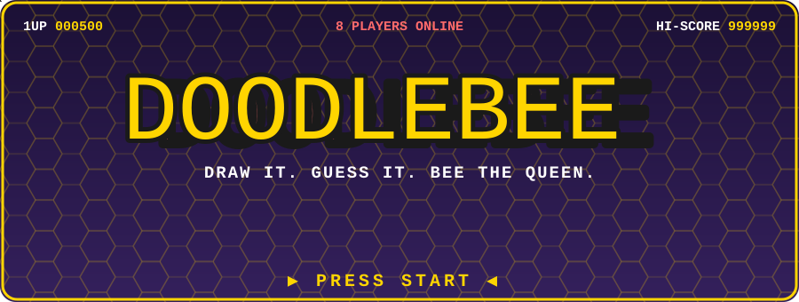
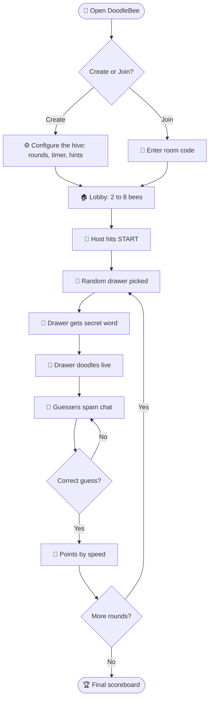
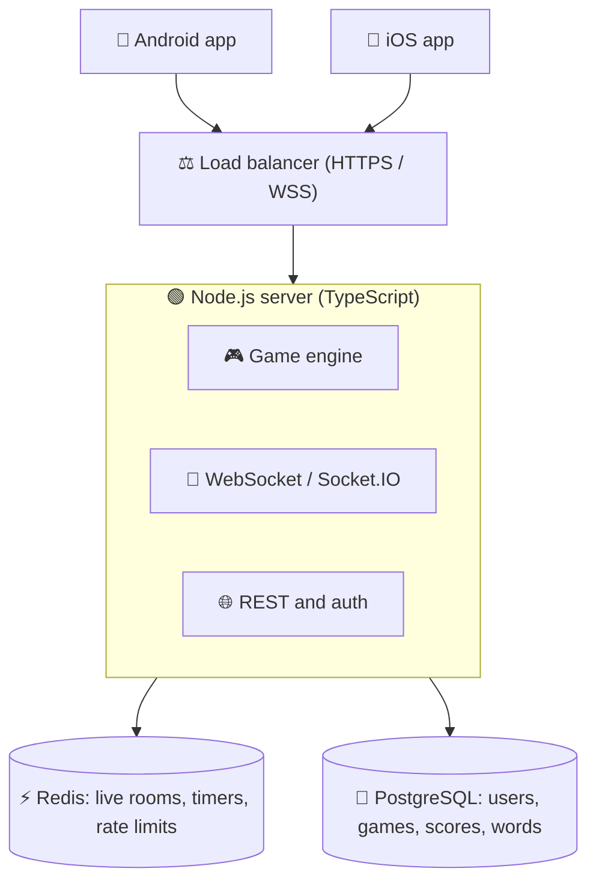
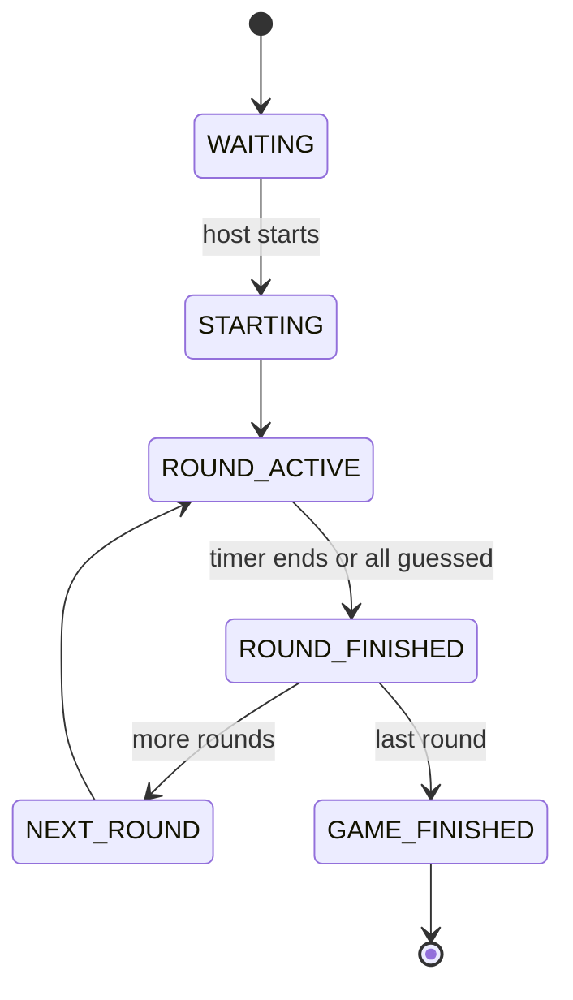
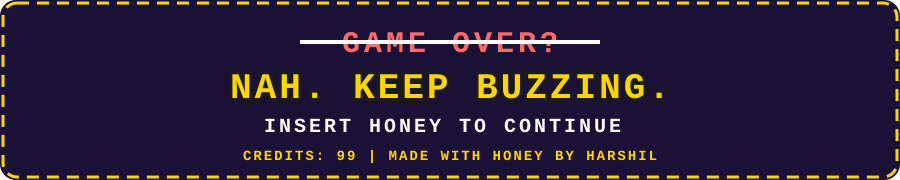

<p align="center">
  
</p>

<p align="center">
  
</p>

<p align="center">
  <a href="https://git.io/typing-svg">
    
  </a>
</p>

<p align="center">
  
  
  
  
  
</p>

<p align="center">
  
  
  
  
  
  
  
  
</p>

<p align="center">
  
  
  
  
</p>

<p align="center">
  
</p>

## 🕹️ MAIN MENU

**[▶ NEW GAME](#-new-game-run-it-locally)** · **[📜 LORE](#-lore)** · **[🎮 HOW TO PLAY](#-how-to-play)** · **[⚡ POWER-UPS](#-power-ups)** · **[🧠 UNDER THE HOOD](#-under-the-hood)** · **[🗺️ LEVELS](#-level-select-roadmap)** · **[🤝 JOIN THE PARTY](#-join-the-party)**

---

## 📜 LORE

> Long ago, in a hive far, far away, bees communicated by **dancing**.
> It was slow. It was confusing. Nobody understood Gary.
>
> So the bees evolved. They picked up **pencils**. 🖍️
> Now one bee draws, the others scream guesses, and Gary *still* can't draw a cat.
>
> **DoodleBee** is a real-time multiplayer **draw-and-guess** mobile game for up to **8 players** per room.
> One bee gets a secret word. Seven bees get chaos.

<p align="center">
  
  
  
  
  
</p>

### 📊 PLAYER STATS *(totally real, trust us)*

| Stat | Value |
|:---|:---|
| 🐝 Downloads | **10,000,000+** *(in our honey-fueled dreams)* |
| 🎨 Masterpieces drawn | Some. A few look like what they claim to be. |
| 😂 Laughs per minute | **Over 9000** |
| 🍯 Honey consumed in dev | Medically concerning |
| 🐛 Bugs squashed | Fewer than bugs created |
| 🧠 Gary's drawing skill | **2 / 100** |

---

## 🎮 HOW TO PLAY

### 🗒️ Quest Log

1. **🔑 Enter a nickname.** Make it iconic. `xX_HoneyBadger_Xx` is taken.
2. **🏠 Create a room** or **join with a code** (like `X7K2P`).
3. **⏳ Wait in the lobby.** 2 to 8 bees. The host hits START.
4. **🎲 Fate picks a Drawer.** They secretly receive a word.
5. **🎨 Draw!** Everyone else watches live and guesses in chat.
6. **🍯 Earn honey.** Faster guess = more points.
7. **🔁 Repeat** for all rounds, then fight for the **Queen Bee** crown. 👑

### 🧙 Choose Your Class

| Class | Who | Special Ability | Weakness |
|:---|:---|:---|:---|
| 🎨 **The Doodler** | The current drawer | Knows the secret word | Cannot spell it out in chat. Obviously. |
| 💬 **The Buzzer** | Everyone else | Guesses via chat, instant feedback | Fingers slower than brain |
| 👑 **Queen Bee** | The host | Configures the game and starts it | Has to wait for the slow friend |
| 🫥 **The Lurker** | The one who "forgot the code" | Vibes | Zero points |

### 🔄 Game Flow



### 💰 LOOT TABLE (Default Scoring)

| Guess Order | Honey | Player Mood |
|:---:|:---:|:---|
| 🥇 1st | **500** | *"I AM A GENIUS."* |
| 🥈 2nd | **350** | *"Fine. I'm fine."* |
| 🥉 3rd | **100** | *"Still on the podium."* |
| 4th | **50** | *"Participating."* |
| 5th | **15** | *"Is this a crumb?"* |
| 6th | **2** | *"Thanks, I guess."* |
| 7th / 8th | **0** | *"I'm here for the vibes."* |

> 🎨 **Drawer bonus:** `Drawer Score = players who guessed correctly x Drawer Bonus`.
> Translation: draw **well**, not like a caffeinated spider.

### 🏅 HALL OF FAME *(mock data, for now)*

| Rank | Player | Honey | Title |
|:---:|:---|---:|:---|
| 👑 1 | `xX_QueenBee_Xx` | 4,200 | Guessed "elephant" in 0.3 sec |
| 🥈 2 | `HoneyBadger` | 3,950 | Cannot be stopped |
| 🥉 3 | `Gary` | 120 | Draws a cat. It is a potato. |
| 4 | `Lurker42` | 0 | Still reading the rules |

---

## ⚡ POWER-UPS

### 🎨 Live Doodling
Brush, eraser, clear canvas, colors, brush sizes. Strokes are streamed as tiny events (`DRAW_START`, `DRAW_MOVE`, `DRAW_END`) instead of screenshots, so it stays smooth on real mobile networks.

### 💬 Chat Is the Game
Guess in chat and get instant feedback. Also supports normal banter, system messages, and big 🎉 correct-answer moments. Built-in rate limiting and spam protection keep the hive clean.

### 💡 Smart Hints
Hints never spoil the whole word at once. Example for **ELEPHANT**:

```text
Start :  _ _ _ _ _ _ _ _
Hint 1:  _ _ E _ _ _ _ _
Hint 2:  _ _ E P _ _ _ _
```

### 🔑 Room Codes You Can Shout
5 to 6 characters, case-insensitive, and no confusing `O/0` or `I/1`. Perfect for yelling across the living room.

### 🔌 Disconnect-Proof
| What happened | What the game does |
|:---|:---|
| 😵 A guesser drops | Game continues, no drama |
| 🎨 The drawer drops | Grace period. Back in time? Carry on. If not, new drawer. |
| 👑 The host leaves | Crown passes to another bee |
| 📶 Your internet dies | Reconnect and your state is restored |

### 🗂️ Word Packs (V1)
`🐘 Animals` `🍕 Food` `📦 Objects` `🗺️ Places` `🧑 People` `👷 Jobs` `⚽ Sports` `💻 Technology` `🌳 Nature` `🎬 Movies` `🚗 Vehicles` `🏃 Actions`

---

## 🧠 UNDER THE HOOD

### 🛡️ THE GOLDEN RULE

> **The client renders the game. The server owns the game.**

| 🖥️ The server decides | 📱 The phone handles |
|:---|:---|
| Who the drawer is | UI |
| What the secret word is | Drawing input |
| When rounds start and end | Chat input |
| Who guessed first | Animations |
| Who is correct | Looking pretty |
| Points and final results | Not cheating (it can't) |

### 🏗️ Architecture



### 🔄 Game State Machine



> ⚠️ Clients never trigger state transitions. Not even if they ask nicely.

### 📡 Real-Time Events

| Event | What it means |
|:---|:---|
| `PLAYER_JOINED` / `PLAYER_LEFT` | The lobby updates live |
| `GAME_STARTED` / `ROUND_STARTED` | Doodling begins |
| `DRAWER_SELECTED` | Fate has chosen |
| `DRAW_START` / `DRAW_MOVE` / `DRAW_END` | Strokes stream in real time |
| `GUESS_SUBMITTED` / `GUESS_CORRECT` | The server judges. Always. |
| `HINT_REVEALED` | A new letter appears |
| `ROUND_ENDED` / `SCORE_UPDATED` | Honey gets counted |
| `GAME_FINISHED` | Confetti time |

Every event has a schema (validated with Zod):

```json
{
  "type": "GUESS_SUBMITTED",
  "roomId": "X7K2P",
  "guess": "elephant"
}
```

### 🎒 LOADOUT (Tech Stack)

| Slot | Item | Rarity |
|:---|:---|:---:|
| 📱 Mobile | React Native + Expo (EAS builds) + Expo Router | 🟣 Epic |
| 🗣️ Language | TypeScript (client and server) | 🟡 Legendary |
| 🧠 Client state | Zustand | 🔵 Rare |
| 📝 Forms and validation | React Hook Form + Zod | 🔵 Rare |
| ✨ Animation | React Native Reanimated | 🟣 Epic |
| 🎨 Drawing | RN-compatible canvas library *(evaluating before lock-in)* | ❓ Mystery box |
| 🖥️ Backend | Node.js + Fastify or NestJS | 🟣 Epic |
| 🔌 Real-time | WebSocket / Socket.IO | 🟡 Legendary |
| 🐘 Database | PostgreSQL | 🟣 Epic |
| ⚡ Live state | Redis | 🟣 Epic |
| 🧪 Testing | Jest + integration / e2e | 🔵 Rare |
| 🚢 CI/CD | GitHub Actions | 🔵 Rare |

### 🧱 Cheat Codes (Engineering Principles)

- 🔒 **Server is authoritative.** Word, roles, timer, ranking, and score all live on the server.
- ⏱️ **Server owns the clock.** Clients display `roundEndTime`; they never decide when a round ends.
- 🧩 **Shared types** between client and server.
- 🙅 **No microservices, Kubernetes, or Kafka in V1.** Build the game first, bee fancy later.
- 🌍 Separate `development`, `staging`, and `production` environments.
- 🔑 Never hardcode production secrets in the app.

---

## 🚀 NEW GAME (Run It Locally)

> 🚧 Scaffolding in progress. These commands are the planned setup and may change.

```bash
# 1. Clone the hive
git clone https://github.com/YOUR_USERNAME/doodlebee.git
cd doodlebee

# 2. Start the backend
cd server
npm install
cp .env.example .env     # add your Postgres + Redis URLs
npm run dev

# 3. Start the mobile app
cd ../mobile
npm install
npx expo start           # scan the QR code with Expo Go

# 4. Gather 2 to 8 friends. Bribe with honey. Play.
```

### 👹 BOSS FIGHTS (Testing)

```bash
npm run test         # unit: scoring, hints, word matching, state machine
npm run test:int     # integration: create, join, start, guess, score
npm run test:chaos   # disconnects, simultaneous guesses, spam, restarts
```

<details>
<summary><b>🐛 The "Please Don't Break" checklist (click to expand)</b></summary>

<br/>

- ✅ 2, 4, and 8 player games
- ✅ Drawer, guesser, and host disconnects
- ✅ Internet disappears and returns
- ✅ Server restarts mid-game
- ✅ Simultaneous correct guesses
- ✅ Full room, invalid code, duplicate guess, chat spam
- ✅ Load: 100 rooms, then 500, 1,000, and 5,000+ players

</details>

---

## 🗺️ LEVEL SELECT (Roadmap)

| Level | Name | Progress | Loot |
|:---:|:---|:---|:---|
| **1** | 🏠 **The Hive** (V1) | `▓▓░░░░░░░░` 20% | Guest nicknames, rooms, live drawing, chat, hints, scoring, reconnection, basic moderation |
| **2** | 🐝 **The Swarm** (V2) | `░░░░░░░░░░` 0% | Friends, public rooms, quick join, leaderboards, stats, achievements, daily challenges, reactions, avatars, themes |
| **3** | 👑 **The Empire** (V3) | `░░░░░░░░░░` 0% | Matchmaking, ranked mode, tournaments, spectator mode, replays, voice chat, shareable results |

**Current objectives:**

- [x] 📝 Write an epic PRD
- [x] 🐝 Pick the best name ever
- [ ] 🔌 WebSocket game engine
- [ ] 🎨 Buttery smooth mobile canvas
- [ ] 🏠 Lobby and room codes
- [ ] 🍯 Scoring and final leaderboard
- [ ] 🚀 Ship to Play Store and App Store
- [ ] 🌍 World domination (gently)

> 🚫 **Not in V1 on purpose:** voice or video chat, global matchmaking, friends system, clans, tournaments, AI-generated drawings, microservices.

### 📝 PATCH NOTES

```text
v0.0.1-alpha
 + Added bees
 + Added honey
 + Added pencils for the bees
 - Removed Gary's ability to draw (for everyone's safety)
 ~ Fixed bug where bee was stuck in the wall
 ~ Known issue: cat still looks like a potato
```

### 🏆 ACHIEVEMENTS (Planned)

| | Achievement | How to unlock |
|:---:|:---|:---|
| 🥇 | **First Blood** | Be the first to guess a word |
| 🧠 | **Mind Reader** | Guess it before the drawer finishes the first line |
| 🥔 | **Potato Artist** | Draw something nobody can guess |
| 📢 | **Chat Goblin** | Get rate-limited for spamming |
| 🍯 | **Honey Hoarder** | Win 5 games in a row |

---

## 💸 THE HONEST BEE PLEDGE

### 🚫 NO PAY-TO-WIN. EVER.

- ✅ **Allowed later:** cosmetic themes, drawing backgrounds, premium word packs, remove-ads.
- ❌ **Never for sale:** extra points, revealed answers, extra guessing time.

---

## ⚔️ RIVAL CLANS

| Game | Similarity | What we steal (respectfully) |
|:---|:---:|:---|
| **Skribbl.io** | ⭐⭐⭐⭐⭐ | The classic draw-and-guess loop |
| **Gartic.io** | ⭐⭐⭐⭐⭐ | Rooms, chat, mobile experience |
| **Drawful 2** | ⭐⭐⭐⭐ | Party-game humor and presentation |
| **Gartic Phone** | ⭐⭐⭐ | Lobby and party UX |

> The mechanic isn't new. **The execution will bee.** Faster rounds, buttery mobile drawing, spicy chat, smart hints, and tight 2 to 8 player private rooms.

---

## 🏁 FINAL BOSS: "SEAMLESS"

V1 is only beaten when **this** runs with zero desyncs:

```text
8 players join -> host starts -> drawer draws -> 7 players see it live
-> everyone guesses at once -> server ranks correctly -> scores update
-> drawer rotates -> next round -> someone disconnects -> game continues
-> they reconnect -> state restores -> all rounds finish -> leaderboard
```

---

## 🤝 JOIN THE PARTY

1. 🍴 Fork the repo
2. 🌿 `git checkout -b feature/more-honey`
3. 💻 Write something awesome
4. ✅ Run tests and lint
5. 📬 Open a Pull Request

Found a bug? Don't swat it, [open an issue](https://github.com/YOUR_USERNAME/doodlebee/issues). 🐛

---

## 📈 STAR HISTORY

<p align="center">
  <a href="https://star-history.com/harshil6-lab/doodlebee&Date">
    
  </a>
</p>

## 🙏 CREDITS

- 🎞️ [Noto Animated Emoji](https://googlefonts.github.io/noto-emoji-animation/) by Google Fonts
- 🏷️ [Shields.io](https://shields.io) for badges
- ⌨️ [Readme Typing SVG](https://github.com/DenverCoder1/readme-typing-svg)
- 🧜 [Mermaid](https://mermaid.js.org) diagrams, rendered natively by GitHub
- ⭐ [Star History](https://star-history.com)
- 🥊 Inspiration from Skribbl.io, Gartic.io, and Drawful
- 🎨 Banners drawn by hand (in SVG) for this repo

<p align="center">
  
</p>
